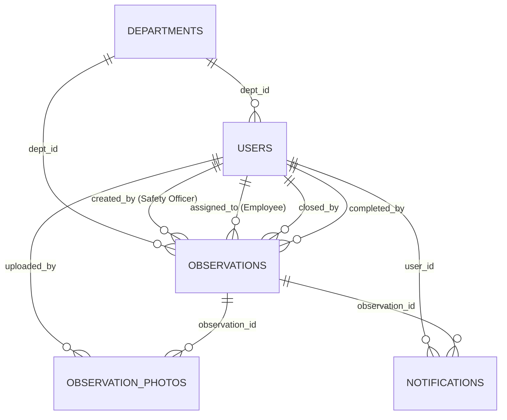

# Health & Safety — Industrial Health & Safety Management System

[](https://react.dev/)
[](https://supabase.com/)
[](#design-system--mobile-responsiveness)
[](#pure-mobile-responsiveness)
[](#safety-reports--regulatory-audits)

**Health & Safety** is an industrial-grade **Health, Safety, and Environmental (EHS) Management System** designed for manufacturing facilities, steel plants, construction sites, and heavy engineering worksites. Built with **React 19, TypeScript, Vite, Supabase, and Vanilla CSS**, it unifies workplace hazard observations, corrective work order tracking, automated risk calculation, review approvals, and real-time employee notifications into a single synchronized platform.

---

## Architecture Overview & Unified Data Model

### The Consolidated Observation & Task Model
In traditional safety tools, an "Observation" is created in one register and a separate "Task" is created in another. In **Health & Safety**, **Observation and Task are unified into a single database record (`public.observations`)**:
- When an observer logs a workplace safety hazard, they simultaneously select the responsible employee (`assigned_to`) and set a resolution deadline (`due_date`).
- A single record represents both the recorded hazard and the corrective work order.
- This eliminates duplicate records, sync latency, and data divergence.



---

## Connected Database Tables & Field Mappings

All backend operations connect directly to PostgreSQL on Supabase via Supabase JS Client (`@supabase/supabase-js`). The tables strictly honor your existing database primary keys (`emp_id` and `dept_id`).

### 1. `public.users` (Existing Table)
Holds authenticated user profiles for both Safety Officers and Plant Employees.
- **Primary Key**: `emp_id` (`BIGINT`)
- **Key Columns**:
  - `emp_id`: Unique employee ID used across all foreign keys.
  - `full_name`: Full display name of the worker.
  - `username`: Login handle (unique).
  - `password`: Direct authentication credential.
  - `role`: Role indicator (`HEALTH_SAFETY_OFFICER`, `admin`, `user`).
  - `status`: Account status (`active`).
  - `dept_id`: Foreign key referencing `public.departments(dept_id)`.
  - `position`, `mobile_number`, `user_access`.
- **Connected Pages**:
  - [LoginPage.tsx](src/pages/auth/LoginPage.tsx): Direct username & password validation against `public.users`.
  - [AppHeader.tsx](src/components/layout/AppHeader.tsx): Displays logged-in user details and provides instant logout.
  - [CreateObservationPage.tsx](src/pages/observations/CreateObservationPage.tsx): Populates the Assignee dropdown (`emp_id`, `full_name`).

---

### 2. `public.departments` (Existing Table)
Stores plant units, divisions, and operational shop floors.
- **Primary Key**: `dept_id` (`BIGINT`)
- **Key Columns**:
  - `dept_id`: Unique department ID.
  - `dept_name` / `name`: Department name (e.g., Blast Furnace, Steel Melting Shop, Rolling Mill).
  - `code`: Abbreviation code (e.g., `BF-01`, `SMS`, `RM`).
  - `is_active`: Operational toggle.
- **Connected Pages**:
  - [CreateObservationPage.tsx](src/pages/observations/CreateObservationPage.tsx) & [CreateObservationModal.tsx](src/components/observations/CreateObservationModal.tsx): Fetches list for the Department dropdown.
  - [AllObservationsPage.tsx](src/pages/observations/AllObservationsPage.tsx): Populates the Department filter dropdown and table badges.
  - [ReportsPage.tsx](src/pages/reports/ReportsPage.tsx): Categorizes audit stats by department.

---

### 3. `public.observations` (Unified Core Table)
The single consolidated table storing both hazard observations and corrective work orders.
- **Primary Key**: `id` (`UUID DEFAULT gen_random_uuid()`)
- **Foreign Keys**:
  - `created_by BIGINT REFERENCES public.users(emp_id)`: The safety officer logging the issue.
  - `dept_id BIGINT REFERENCES public.departments(dept_id)`: The plant department where the hazard exists.
  - `assigned_to BIGINT REFERENCES public.users(emp_id)`: The employee responsible for taking corrective action.
  - `closed_by BIGINT REFERENCES public.users(emp_id)`: User who performed final administrative sign-off.
  - `completed_by BIGINT REFERENCES public.users(emp_id)`: Safety officer who verified and approved completion.
- **Hazard Details**:
  - `area` (`VARCHAR(255)`): Specific machinery, floor, or location.
  - `observation_text` (`TEXT`): Description of the hazard or unsafe condition.
  - `solution_text` (`TEXT`): Recommended prevention or correction guideline.
  - `priority` (`VARCHAR(20)`): `'LOW'`, `'MEDIUM'`, or `'HIGH'`.
  - `risk_min` (`NUMERIC(3,1)`): Minimum risk score percentage.
  - `risk_max` (`NUMERIC(3,1)`): Maximum risk score percentage.
- **Work Order & Review Fields**:
  - `due_date` (`TIMESTAMPTZ`): Resolution target deadline.
  - `status` (`VARCHAR(50)`): Work order state (`OPEN`, `ASSIGNED`, `IN_PROGRESS`, `SUBMITTED_FOR_REVIEW`, `REWORK_REQUIRED`, `COMPLETED`, `OVERDUE`, `CLOSED`).
  - `corrective_action` (`TEXT`): Resolution proof submitted by the assignee.
  - `rework_reason` (`TEXT`): Mandatory feedback if the officer rejects submitted proof and demands rework.
  - `is_personal` (`BOOLEAN`): Toggle for standalone monitoring observations.
- **Audit Timestamps**: `created_at`, `updated_at`, `completed_at`, `closed_at`.
- **Connected Pages**:
  - [CreateObservationPage.tsx](src/pages/observations/CreateObservationPage.tsx): Inserts new hazard + assigned task.
  - [AllObservationsPage.tsx](src/pages/observations/AllObservationsPage.tsx): Displays all observations with live status filters and dynamic `#Sr No` loop.
  - [MyTasksPage.tsx](src/pages/tasks/MyTasksPage.tsx): Employee view of assigned tasks where corrective action is submitted.
  - [ReportsPage.tsx](src/pages/reports/ReportsPage.tsx): Aggregates hazard turnaround metrics and CSV export.
  - [DashboardPage.tsx](src/pages/dashboard/DashboardPage.tsx): Live KPI cards, risk distribution charts, and SLA stats.

---

### 4. `public.observation_photos`
Stores photo evidence for initial hazard inspection and subsequent corrective resolution.
- **Primary Key**: `id` (`UUID DEFAULT gen_random_uuid()`)
- **Foreign Keys**:
  - `observation_id UUID REFERENCES public.observations(id) ON DELETE CASCADE`
  - `uploaded_by BIGINT REFERENCES public.users(emp_id)`
- **Key Columns**:
  - `photo_url` (`TEXT`): Base64 data URI or Supabase Storage image URL.
  - `file_name` (`VARCHAR(255)`): Original uploaded image filename.
  - `photo_type` (`VARCHAR(50)`):
    - `'INITIAL'`: Taken when hazard is logged by officer.
    - `'CORRECTIVE'`: Taken as proof of resolution by assigned worker.
  - `created_at` (`TIMESTAMPTZ DEFAULT NOW()`)
- **Connected Components**:
  - [PhotoUploader.tsx](src/components/common/PhotoUploader.tsx): Captures, resizes, and prepares photos.
  - Observation Detail Modal: Renders before-and-after image galleries.

---

### 5. `public.notifications`
In-app alert center for assignments, review submissions, rework, and overdue tasks.
- **Primary Key**: `id` (`UUID DEFAULT gen_random_uuid()`)
- **Foreign Keys**:
  - `user_id BIGINT REFERENCES public.users(emp_id) ON DELETE CASCADE`
  - `observation_id UUID REFERENCES public.observations(id) ON DELETE CASCADE`
- **Key Columns**:
  - `notification_type` (`VARCHAR(50)`): `'TASK_ASSIGNED'`, `'CORRECTIVE_SUBMITTED'`, `'REWORK_REQUESTED'`, `'TASK_COMPLETED'`, `'TASK_OVERDUE'`.
  - `title` (`VARCHAR(200)`): Alert heading.
  - `message` (`TEXT`): Detailed notification body.
  - `is_read` (`BOOLEAN DEFAULT FALSE`): Read status indicator.
  - `created_at` (`TIMESTAMPTZ DEFAULT NOW()`)
- **Connected Components**:
  - [NotificationDropdown.tsx](src/components/layout/NotificationDropdown.tsx): Top header unread badge and dropdown list.
  - [NotificationsPage.tsx](src/pages/notifications/NotificationsPage.tsx): Full notification history and 1-click mark-all-read.

---

## Detailed Explanation of PostgreSQL Triggers & Functions

The system leverages database-level triggers and functions in `supabase/pages_schema.sql` to maintain data integrity, automate industrial risk calculations, and guarantee consistent audit timestamps.

### 1. Trigger: Automatic Risk Factor Calculation (`trg_calculate_observation_risk`)
```sql
CREATE OR REPLACE FUNCTION trg_calculate_observation_risk()
RETURNS TRIGGER AS $$
BEGIN
    IF NEW.priority = 'LOW' THEN
        NEW.risk_min := 1.0;
        NEW.risk_max := 3.0;
    ELSIF NEW.priority = 'MEDIUM' THEN
        NEW.risk_min := 3.0;
        NEW.risk_max := 6.0;
    ELSIF NEW.priority = 'HIGH' THEN
        NEW.risk_min := 6.0;
        NEW.risk_max := 9.0;
    END IF;
    RETURN NEW;
END;
$$ LANGUAGE plpgsql;

CREATE TRIGGER set_observation_risk
    BEFORE INSERT OR UPDATE OF priority ON public.observations
    FOR EACH ROW
    EXECUTE FUNCTION trg_calculate_observation_risk();
```
- **Why it exists**: Industrial safety standards (such as ISO 45001) require hazards to be quantified by a risk factor range based on probability and severity.
- **What it does**: 
  - Fired automatically before any `INSERT` or `UPDATE` on the `priority` column of `public.observations`.
  - If priority is `'LOW'`, sets risk range to **1.0% – 3.0%**.
  - If priority is `'MEDIUM'`, sets risk range to **3.0% – 6.0%**.
  - If priority is `'HIGH'`, sets risk range to **6.0% – 9.0%**.
- **Benefit**: Ensures the database remains consistent regardless of whether inserts come from the web app, mobile device, or direct SQL inserts.

---

### 2. Trigger: Automatic Modification Timestamp (`trg_update_observation_timestamp`)
```sql
CREATE OR REPLACE FUNCTION trg_update_observation_timestamp()
RETURNS TRIGGER AS $$
BEGIN
    NEW.updated_at = NOW();
    RETURN NEW;
END;
$$ LANGUAGE plpgsql;

CREATE TRIGGER update_observations_modtime
    BEFORE UPDATE ON public.observations
    FOR EACH ROW
    EXECUTE FUNCTION trg_update_observation_timestamp();
```
- **Why it exists**: Prevents stale timestamps when status changes (e.g., when an employee submits proof, or an officer reviews).
- **What it does**: Automatically updates `updated_at = NOW()` whenever any observation row is modified.

---

### 3. Function: Automated Overdue Detector (`check_and_update_overdue_tasks`)
```sql
CREATE OR REPLACE FUNCTION public.check_and_update_overdue_tasks()
RETURNS INTEGER AS $$
DECLARE
    overdue_count INTEGER := 0;
    r RECORD;
BEGIN
    FOR r IN 
        SELECT o.id, o.created_by, u.full_name as assignee_name
        FROM public.observations o
        JOIN public.users u ON o.assigned_to = u.emp_id
        WHERE o.due_date < NOW()
          AND o.status NOT IN ('COMPLETED', 'CLOSED', 'OVERDUE')
    LOOP
        UPDATE public.observations 
        SET status = 'OVERDUE', updated_at = NOW() 
        WHERE id = r.id;

        INSERT INTO public.notifications (user_id, observation_id, notification_type, title, message)
        VALUES (
            r.created_by,
            r.id,
            'TASK_OVERDUE',
            'Overdue Safety Action',
            'Observation task assigned to ' || r.assignee_name || ' has passed its resolution due date.'
        );

        overdue_count := overdue_count + 1;
    END LOOP;
    RETURN overdue_count;
END;
$$ LANGUAGE plpgsql;
```
- **Why it exists**: Enables database-level background escalation.
- **What it does**: 
  - Scans `public.observations` for any tasks where `due_date < NOW()` and status is not yet `'COMPLETED'` or `'CLOSED'`.
  - Automatically updates their status to `'OVERDUE'`.
  - Creates a high-priority alert in `public.notifications` for the safety officer who created the task, identifying the employee name.
- **How to invoke**: Can be called manually via `SELECT public.check_and_update_overdue_tasks();` or scheduled with `pg_cron`.

---

### 4. Row Level Security (RLS) Policies
All tables have Row Level Security enabled to ensure secure API interactions:
```sql
ALTER TABLE public.observations ENABLE ROW LEVEL SECURITY;
ALTER TABLE public.observation_photos ENABLE ROW LEVEL SECURITY;
ALTER TABLE public.notifications ENABLE ROW LEVEL SECURITY;

CREATE POLICY "Observations open access" ON public.observations FOR ALL USING (TRUE) WITH CHECK (TRUE);
CREATE POLICY "Observation photos open access" ON public.observation_photos FOR ALL USING (TRUE) WITH CHECK (TRUE);
CREATE POLICY "Notifications open access" ON public.notifications FOR ALL USING (TRUE) WITH CHECK (TRUE);

-- Storage Bucket 'observation' Policies (Upload & Read Inspection Photos)
CREATE POLICY "Public Upload to observation bucket"
ON storage.objects FOR INSERT TO public
WITH CHECK (bucket_id = 'observation');

CREATE POLICY "Public Read from observation bucket"
ON storage.objects FOR SELECT TO public
USING (bucket_id = 'observation');
```

---

## Observation Lifecycle & Statuses

The workflow moves through 8 well-defined states grouped into **3 primary user stages** in the sidebar:

```text
[Hazard Observed]
       │
       ▼
 [ ASSIGNED ] ──────────────► [ IN_PROGRESS ]
                                     │
                                     ▼
                        [ SUBMITTED_FOR_REVIEW ]
                                     │
                 ┌───────────────────┴───────────────────┐
                 ▼                                       ▼
        [ REWORK_REQUIRED ]                         [ COMPLETED ]
        (Feedback attached;                              │
         returns to worker)                              ▼
                                                     [ CLOSED ]
```

### 3 Primary Navigation Stages
In the sidebar under **All Observations & Tasks**, filters are streamlined to:
1. **Pending** (`/observations?status=PENDING`): Any active observation requiring action (`ASSIGNED`, `IN_PROGRESS`, `SUBMITTED_FOR_REVIEW`, `REWORK_REQUIRED`, `OPEN`) where resolution is still within due date.
2. **Completed** (`/observations?status=COMPLETED`): Any observation whose corrective action has been verified and approved (`COMPLETED`, `CLOSED`).
3. **Overdue** (`/observations?status=OVERDUE`): Any observation that has passed its `due_date` without completion.

---

## Pure Mobile Responsiveness

The system is built for extreme mobile usability in shop floor environments:
- **Responsive Navigation**: Clean sidebar on desktop, fixed bottom navigation bar on mobile (`<900px`) with safe-area insets.
- **Header Dropdowns**: Bounded with `maxWidth: calc(100vw - 24px)` to eliminate accidental horizontal overflow.
- **Horizontal Swipe Tables**: Tables wrapped in smooth momentum scrolling containers (`-webkit-overflow-scrolling: touch`).
- **Mobile Bottom Sheets**: Observation details and inspection modals transform into full-width bottom sheets on mobile viewports (`max-height: 94vh`).
- **Touch-Friendly Controls**: Minimum touch target size $\ge 40\text{--}44\text{px}$ and font-size of 16px on inputs to prevent iOS Safari auto-zoom.

---

## Installation & Local Setup

### 1. Prerequisites
- Node.js (v18 or higher)
- npm or yarn
- Active Supabase project

### 2. Environment Configuration
Create a `.env` file in the project root:
```env
VITE_SUPABASE_URL=https://your-project-ref.supabase.co
VITE_SUPABASE_ANON_KEY=your-supabase-anon-key
```
*(Note: `.env` is automatically ignored in `.gitignore` to prevent credential leaks).*

### 3. Database Setup
1. Open your **Supabase Dashboard $\rightarrow$ SQL Editor $\rightarrow$ New Query**.
2. Copy and execute the contents of [`supabase/pages_schema.sql`](supabase/pages_schema.sql).
3. Tables, foreign keys, triggers, and RLS policies will be generated immediately.

### 4. Running the Development Server
```bash
npm install
npm run dev
```
Open `http://localhost:5173` in your browser.

### 5. Building for Production
```bash
npm run build
```
Generates an optimized, type-checked bundle in the `dist/` directory with 0 errors.

---

## License
Proprietary software developed for industrial safety compliance, workplace hazard management, and ISO 45001 alignment.
